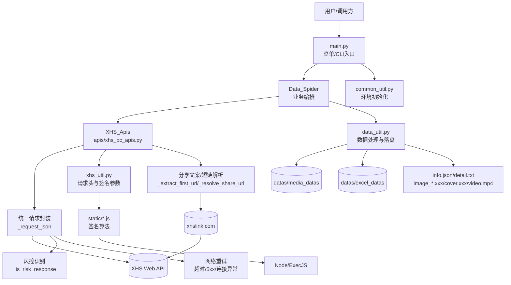
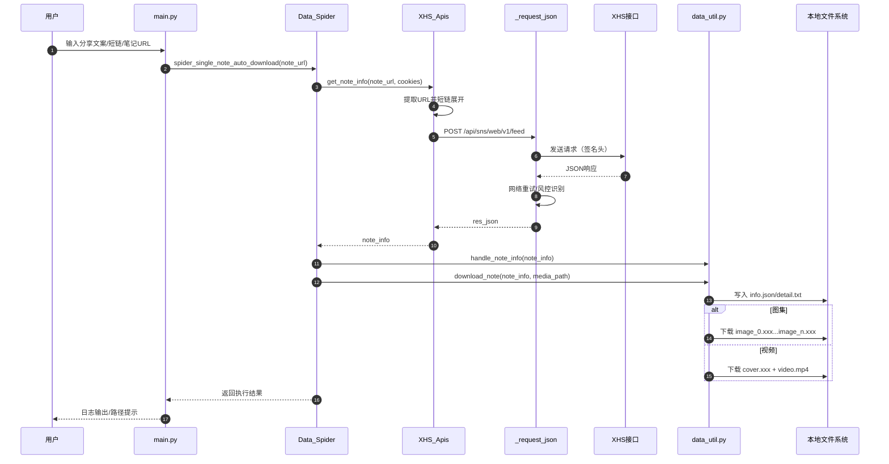

# Spider_XHS 架构设计

## 1. 目标与范围

本项目是一个基于小红书 Web 接口的采集工具，核心目标是：

- 支持单条笔记、批量笔记、用户作品、**用户收藏笔记**、关键词搜索等采集场景。
- 自动解析图文/视频笔记并下载媒体内容。
- 结构化落盘（`json/txt/excel/media`），便于后续检索与复用。
- 在请求链路中内置网络重试与风控停止策略，降低失败放大风险。

不在本设计范围：

- 绕过平台风控的对抗性能力。
- 分布式爬虫调度系统（当前是单进程本地执行）。

---

## 2. 总体架构

系统采用“入口编排 + API 适配 + 签名生成 + 数据处理/下载”的分层结构。

- 入口层：`main.py`
  - 提供交互菜单与 CLI 参数模式。
  - 负责选择功能分支并组织调用。
- 业务编排层：`Data_Spider`（`main.py`）
  - 聚合 API 获取、数据清洗、下载与保存。
  - 对外提供单条、批量、用户、搜索等统一能力。
- API 适配层：`apis/xhs_pc_apis.py`、`apis/xhs_creator_apis.py`
  - 封装所有请求接口。
  - 负责 URL 参数拼装、签名请求头构造、返回解析。
- 签名与请求参数层：`xhs_utils/xhs_util.py`、`xhs_utils/xhs_creator_util.py` + `static/*.js`
  - 使用 `execjs` 调用 JS 计算 `x-s/x-t/x-s-common`。
  - 从 `COOKIES` 中提取 `a1` 参与签名。
- 数据处理与落盘层：`xhs_utils/data_util.py`
  - 标准化 note/user/comment 数据。
  - 下载图片/视频，保存 `info.json`、`detail.txt`、`excel`。

---

## 3. 关键流程

## 3.1 单条笔记自动下载流程

1. 用户输入（可为完整文案、短链、完整笔记 URL）。
2. `get_note_info` 先提取 URL，若是 `xhslink` 则自动重定向展开。
3. 解析 `note_id/xsec_token/xsec_source`，调用 `/api/sns/web/v1/feed`。
4. `handle_note_info` 统一抽取笔记结构，识别 `图集/视频`。
5. `download_note` 根据类型下载对应媒体并写入详情文件。

## 3.2 搜索与用户场景流程

- 搜索模式：`search_note` 分页获取 -> 汇总 note -> 批量拉详情/下载。
- 用户模式：`get_user_note_info` 分页获取用户作品 -> 生成 note URL -> 下载。

---

## 4. 请求可靠性与风控策略

为保证整文件一致策略，`xhs_pc_apis.py` 使用统一请求封装：

- `_request_json(...)`
  - 网络级重试：超时、连接异常、5xx（默认 3 次，间隔 1.5s）。
  - 风控识别：401/403/429、验证码/鉴权关键词命中。
  - 风控命中即停止重试并返回明确错误（避免硬刷）。
- `_is_risk_response(...)`
  - 从状态码、响应文本、JSON `msg/code` 三个维度识别风险。

说明：

- `xhslink` 展开和“无水印视频页面抓取”属于非 JSON 页面请求，保留独立处理。

---

## 5. 数据模型与存储设计

## 5.1 目录结构

- 媒体目录：`datas/media_datas`
- Excel 目录：`datas/excel_datas`

单条笔记落盘结构：

- `datas/media_datas/{nickname}_{user_id}/{title}_{note_id}/`
  - `info.json`：原始结构化信息
  - `detail.txt`：可读摘要
  - 图集：`image_0.xxx`, `image_1.xxx`...
  - 视频：`cover.xxx`, `video.mp4`

## 5.2 命名规则

- 目录名来源于昵称、标题、ID，经过非法字符清洗与长度截断。
- 图片后缀由响应 `Content-Type` 与文件头自动推断（避免后缀错配导致打不开）。

---

## 6. 入口与交互设计

`main.py` 支持两类入口：

- 交互菜单（1-5）
  - 1 单条下载
  - 2 批量 URL 下载
  - 3 用户全部笔记
  - 4 关键词搜索
  - 5 退出
  - 输入校验：非法输入循环重试
- CLI 参数模式
  - `--mode single/list/user/search`
  - 配套参数：`--note-url/--notes/--user-url/--query/--query-num/--save-choice/--excel-name`

---

## 7. 主要模块职责

- `main.py`
  - 功能路由、参数解析、任务触发。
- `apis/xhs_pc_apis.py`
  - 小红书 PC API 统一入口与请求治理。
- `xhs_utils/xhs_util.py`
  - JS 签名桥接、请求头模板、cookie 参数转换。
- `xhs_utils/data_util.py`
  - 数据规范化、媒体下载、文本与 Excel 持久化。
- `static/*.js`
  - 签名算法与相关计算逻辑。

---

## 8. 异常处理原则

- 网络抖动：自动重试并记录重试日志。
- 风控/鉴权：立即停止重试并上报错误。
- 数据异常：空 URL、无效 token、缺字段时给出可读错误。
- 下载异常：校验返回内容类型，避免写入损坏文件。

---

## 9. 扩展建议

- 可观测性：引入统一请求 ID、成功率/403率/重试次数指标。
- 任务治理：按账号维度做并发和速率限流。
- 配置中心：将重试次数、延迟、风控阈值配置化。
- 服务化：将当前 CLI 包装成 HTTP API（如 FastAPI）供外部系统调用。
- 测试体系：增加集成测试与回归样例（单条/用户/搜索/菜单输入）。

---

## 10. 安全与合规建议

- `.env` 不入库，敏感 cookie 必须最小化暴露。
- 避免高频、批量、无间隔请求，遇风控立即停机。
- 严格遵守目标平台条款与适用法律，仅用于授权范围内的数据处理。

---

## 11. 架构图（Mermaid）

### 11.1 组件关系图

### 11.2 单条笔记（`single`）时序图

