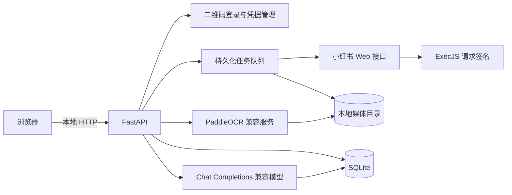

# 拾页（Shiyi）

> 把小红书里偶然发现的内容，变成可整理、可检索、可导出、可与 AI 对话的本地素材库。

拾页是在原有 `Spider_XHS` 采集能力上扩展出的本地网页工作台。它把扫码登录、链接采集、图文与视频阅读、PaddleOCR、文件夹和标签、结构化导出，以及多素材 AI 对话放进同一条工作流。

项目目前处于个人原型阶段，默认仅监听本机 `127.0.0.1`。笔记、媒体、账号凭据、OCR Key 和模型 Key 都保存在本地，不进入 Git。


## 为什么做拾页

收藏只是一次保存动作。只有当内容能够被再次找到、组合、核对和调用，它才真正进入个人知识体系。

拾页希望解决的是这条链路：

```text
小红书链接
    ↓
采集标题、正文、图片与视频
    ↓
OCR 补全图片中的文字
    ↓
本地分类、搜索与导出
    ↓
@ 选定素材，与 AI 对话
```

## 当前已完成

### 本地素材工作台

- React + TypeScript + Vite 前端，Python + FastAPI 后端。
- SQLite 保存笔记索引、文件夹、个人标签、任务状态和对话历史；媒体文件保留在本地目录。
- 首次打开创建本地管理员；已有采集目录可自动导入。
- 总素材库支持卡片/列表浏览、中文搜索、类型与标签筛选、排序和分页。
- 图文翻页、视频播放、正文、互动数据、原标签、个人标签和 OCR 结果集中显示。
- 多层文件夹、拖拽归类、回收站、恢复与永久清理。

### 登录与采集

- 网页生成小红书登录二维码，扫码后的凭据加密保存。
- 登录过期时，采集任务进入等待状态；重新扫码后自动恢复。
- 平台限流、验证码和登录失效分开处理，避免把风控错误当作 Cookie 过期反复请求。
- 支持分享文案、单条链接、批量链接、作者主页、收藏页和关键词采集。
- 按笔记 ID 去重；已有内容跳过，缺失媒体补齐。
- 任务状态持久化，网页关闭后继续运行；服务重启后从已完成的文件边界恢复。

### OCR 与导出

- 在设置中连接兼容 PaddleOCR 协议的服务，可配置地址、模型和 Key，并进行连接测试。
- 支持单条或批量 OCR；图片结果以 Markdown 保存，已完成的图片自动跳过。
- 异步 OCR 保存服务端任务 ID，服务重启后继续查询。
- OCR 文字汇总进 `ai_context/note_ai_context.txt` 和 `note_ai_context.json`，可用于检索与 AI 上下文。
- 支持导出原始媒体、TXT、JSON、OCR Markdown、Excel，以及多文件 ZIP。

### AI 对话原型

- 在素材库多选后点击“问 AI”，或在对话中输入 `@` 搜索并引用素材。
- 一轮最多引用 8 份图文或视频，支持比较、提炼、行动清单和创作提纲等场景。
- 兼容 Chat Completions 接口，可添加多个模型并独立配置视觉能力；模型 Key 加密保存在本机。
- 图文发送正文、已有 OCR 和抽样图片；视频均匀抽取画面，不上传完整视频。
- 支持流式回答、停止生成、连续追问、引用回看、历史搜索、重命名、删除和 Markdown 导出。
- 请求只包含用户明确选择的素材，不会自动上传整个素材库。

## 当前边界

- 还不能从小红书分享面板直接发送到拾页，目前需要复制链接后粘贴到网页。
- AI 对话通过显式 `@素材` 选择上下文，尚未加入全库向量索引和自动检索。
- 视频只提供抽样画面，尚未提取音轨或生成语音转写，因此不能覆盖完整视频语义。
- 评论全文尚未接入，当前只展示已经采集到的评论数量。
- 平台接口、请求签名和风控策略会变化；遇到验证码或平台限制时，拾页会暂停并提示人工处理。
- 当前以本机单用户使用为目标，不提供公网多租户部署保证。

## 技术架构



| 层 | 技术与职责 |
| --- | --- |
| 前端 | React 19、TypeScript、Vite；素材库、任务中心、设置与 AI 对话 |
| 本地 API | FastAPI；鉴权、笔记、分类、导出、二维码、OCR 与聊天接口 |
| 任务执行 | 独立 Python worker；采集/OCR 状态持久化、暂停、恢复、取消与重试 |
| 数据 | SQLAlchemy + SQLite 保存索引；图片、视频和文本保存在本地文件系统 |
| 平台适配 | PC/创作者接口、短链解析、JS 签名、风控识别与网络重试 |
| AI | PaddleOCR 兼容接口；Chat Completions 兼容接口；SSE 流式回传 |

更详细的说明见 [本地工作台](docs/LOCAL_WORKBENCH.md)、[AI 对话工作台](docs/AI_WORKSPACE.md) 和 [架构文档](docs/ARCHITECTURE.md)。

## 快速开始

### 环境要求

- Python 3.11+
- Node.js 22.12+ 或 Node.js 24
- macOS / Linux；Windows 尚未完成完整验证
- 视频抽帧与可选音频处理需要本机可用的 OpenCV / ffmpeg 环境

### 首次安装

```bash
uv sync --group dev
npm ci
npm --prefix frontend ci
npm --prefix frontend run build
bash scripts/web.sh
```

macOS 也可以在完成依赖安装后双击 `启动拾页.command`。

浏览器会打开：

```text
http://127.0.0.1:8765
```

首次使用时创建本地管理员，然后在右上角连接小红书账号。OCR 与 AI 模型均在“设置”中按需添加，无须把 Key 写进前端代码。

### 日常启动

```bash
bash scripts/web.sh
```

关闭浏览器不会停止后台任务。在启动终端按 `Ctrl+C` 才会停止服务。

### 原 CLI

原有命令行入口仍然保留：

```bash
python main.py --help
python main.py
```

## 本地数据与安全

- `datas/app/`：SQLite、加密密钥、账号凭据和应用状态。
- `datas/media_datas/`：笔记正文、结构化信息、图片、视频、OCR 与 AI 上下文。
- `datas/excel_datas/`：Excel 导出。
- `.env`：可选的首次配置来源，不进入 Git。

备份前请停止服务，并同时备份 `datas/app/` 与媒体目录。`datas/app/secret.key` 用于解密本地凭据，丢失后无法恢复已保存的 Cookie 和 Key。

应用 HTTP 请求显式直连，不读取 `HTTP_PROXY`、`HTTPS_PROXY` 或 `ALL_PROXY` 环境变量；HTTPS 证书验证保持开启。系统级 VPN/TUN 路由仍由操作系统管理。

请只处理自己有权访问的内容，控制采集频率，并遵守平台条款、作者权益和适用法律。本项目不提供绕过验证码或对抗平台风控的能力。

## 开发与验证

```bash
# 前端开发，/api 代理到本地后端
npm --prefix frontend run dev

# 前端生产构建
npm --prefix frontend run build

# Python 回归测试
.venv/bin/python -m pytest tests -q

# 隔离数据的浏览器端到端测试
npm --prefix frontend run test:e2e
```

当前 Python 回归结果：`45 passed`。测试覆盖素材与分类、任务恢复、扫码状态、OCR、导出、AI 多附件、图片与视频抽帧、对话历史、停止生成、密钥保护和访问控制。

## 路线图

### P0：先解决每天都会碰到的阻力

- 探索系统分享扩展、移动端接收入口、浏览器扩展与剪贴板识别，缩短“看到内容 → 收进拾页”的路径。
- 继续提高二维码登录、接口字段变化和平台限制状态的可诊断性。
- 完善失败任务的单条错误汇总、断点恢复和重试边界。

### P1：让素材更完整、更容易被调用

- 视频音轨提取、语音转写与时间戳引用。
- 关键词、标签、文件夹与向量相似度结合的混合检索。
- 收藏夹增量同步、内容更新检测和重复素材合并。
- AI 回答的引用校验、上下文覆盖范围和成本提示。

### P2：降低安装和长期维护成本

- macOS / Windows 一键安装包与自动依赖检查。
- 数据备份、迁移、版本升级与索引重建入口。
- 可选的本地模型、插件/API 接口，以及更多内容来源适配。
- 在不暴露凭据与本地原始资料的前提下，支持多设备使用。

## 项目状态

拾页仍是一个持续迭代的个人原型。当前重点是验证“采集 → 补全 → 整理 → 调用”的闭环，并优先减少日常使用中的摩擦。欢迎通过 Issue 提交可复现的问题和具体使用场景。
